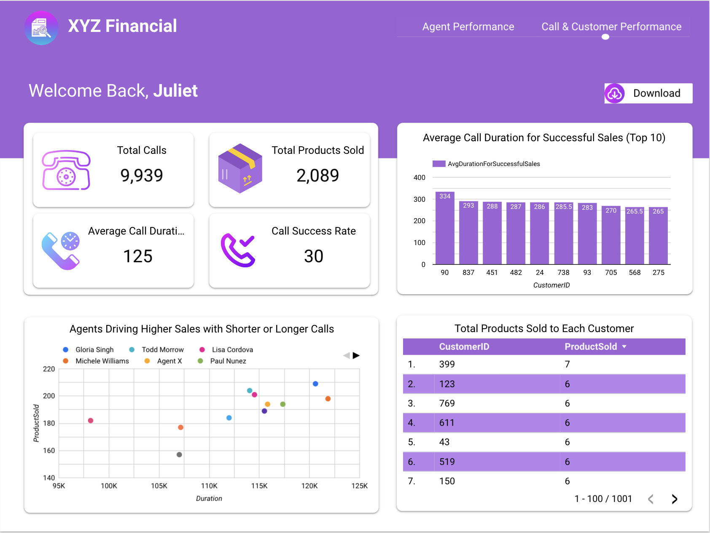

# Analyzing the "Sales of Financial Products for XYZ Company" 

Dataset: "Product_Sales.csv" file

Link to report on Looker Studio: https://lookerstudio.google.com/s/jJ1yV3S4wNc

## 1. Understand the Dataset
The dataset contains 7 columns and 9,939 observations. It provides details about calls made by agents to customers and the sales generated.

### Insights I Derived

1. Agent Performance:
- Total products sold by each agent.
- Conversion rate per agent.
- Average duration of calls leading to a sale.

2. Customer Behavior:
- Pickup rate (calls answered by customers / total calls).
- Average number of products sold to each customer.

3. Call Performance:
- Average call duration.
- Call success rate (pickup rate and product sold rate combined).

4. Overall Business Metrics:
- Total products sold.
- Total calls made.
- Correlation between call duration and sales.

5. Decision-Making Insights:
- Identify top-performing agents for promotion or salary increase.
- Determine areas for training (e.g., agents with low conversion rates).

## 2. Perform Data Analysis
### Step 1: Data Cleaning Using Python
- Import lbraries
- Load the dataset
- Check for missing values
- Handle missing values
- Verify data types
- Check for duplicate values & handle them
- Standardize columns

### Step 2: Data Transformation and Analysis
1. Created new dimensions/fields such as, PickedUp_Numeric, SuccessfulSale_Numeric, and SuucessfulSale_Duration
2. Calculated metrics (Pickup rate, conversion rate, average duration for successful sale, & overall call success rate)
3. Found the correlation between call duration and sales

### Step 3: Data Visualization Using Google Looker Studio:
1. Import the cleaned dataset (saved as a CSV or Excel file) into Google - Sheets or BigQuery.
2. Connect Looker Studio to your data source.
3. Create the following visuals:
- Bar Chart: 
- KPI Cards / Score cards
- Tables
- Scatter Plot: Correlation between call duration and products sold per agent.
- Filters: Enable filters for other visuals by AgentName.

## 3. Case Study: XYZ Financial Services
### Company Background
XYZ Financial Services specializes in offering tailored financial products. The sales team makes outbound calls to customers, introducing them to new financial products and services.

### Insights for Stakeholders
1. Agent Insights:
- Top-performing agents (e.g., agents with the highest total sales and conversion rates).
- Agents with low performance requiring training.

2. Customer Insights:
- High-value customers (customers purchasing the most products).
- Average pickup rates to assess customer engagement.

3. Call Insights:
- Calls with the highest success rates.
- Optimal call durations for sales conversions.

### Actionable Recommendations
- Promote or reward agents with consistently high performance.
- Provide additional training to agents with low conversion rates.
- Optimize call durations to improve efficiency and conversion rates.

## 4. Decision-Making for Promotions or Salary Increases
1. Use the Agent Performance Table to rank agents by:
- Total products sold.
- Conversion rate.
- Average call duration.

2. Reward top-performing agents with promotions or salary increases.
Example criteria:
- Agents with sales in the top 10% and conversion rates above the median.
- Recognize agents reducing call durations without impacting sales.

## 5. Step-by-Step Workflow Summary
1. Data Cleaning:
- Remove duplicates, handle missing values, and standardize data formats.

2. Data Transformation:
- Create aggregated metrics for agents and customers.

3. Exploratory Data Analysis:
- Use Python to calculate key metrics and correlations.

4. Visualization:
- Use Google Looker Studio to create an interactive dashboard.

5. Insights and Storytelling:
- Present findings and recommendations to stakeholders.

By following this process, I was able to derive actionable insights that help XYZ Financial Services make data-driven decisions regarding agent performance, customer behavior, and call strategy.

### Dashboard 👇
 
 

### Full report 👇
